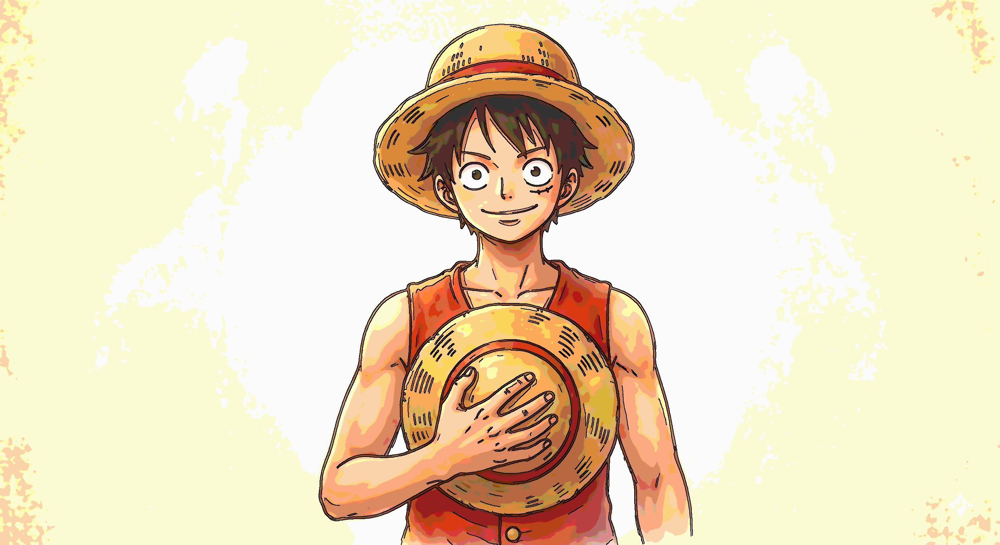
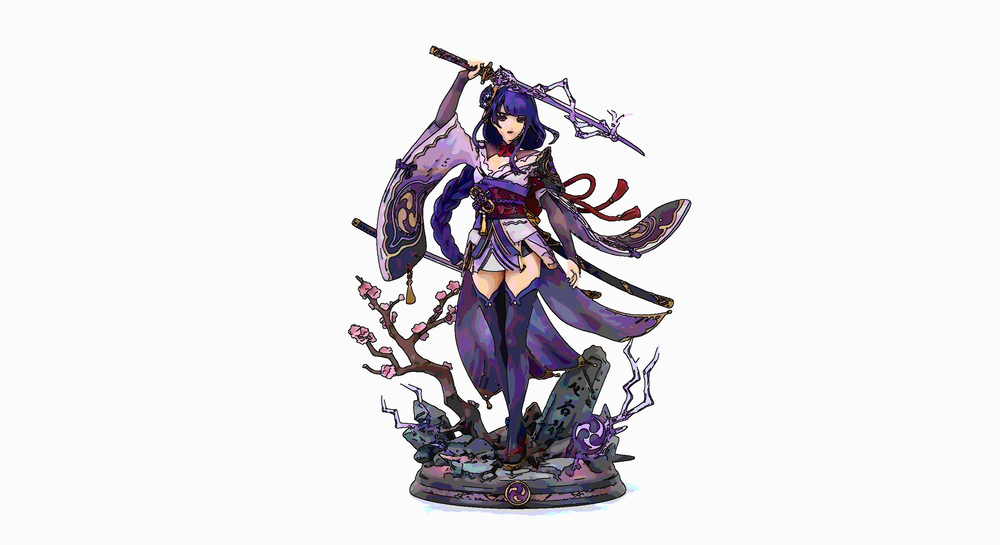

# cartooner

OpenCV로 이미지를 만화처럼 보이도록 변환하는 간단한 프로젝트입니다.

## 실행 방법

```bash
pip install opencv-python
python main.py input.jpg
```

실행하면 입력 파일과 같은 폴더에 `input_cartoon.jpg`가 저장되고, 결과 이미지가 화면에 표시됩니다.

## 사용한 알고리즘

현재 알고리즘은 아래 순서로 동작합니다.

1. `bilateralFilter`를 여러 번 적용해서 색 영역을 부드럽게 정리한다.
2. `posterize`를 사용해서 색 단계를 줄이고 사진의 연속 톤을 단순화한다.
3. HSV 공간에서 채도와 밝기를 조금 올려 색을 더 또렷하게 만든다.
4. `Canny edge`로 윤곽선을 검출하고 최종 컬러 이미지에 검은 선처럼 합성한다.

## 데모 및 한계점 논의

### 1. 만화 같은 느낌이 잘 표현되는 이미지 데모

아래 예시는 배경이 비교적 단순하고 피사체의 외곽선이 뚜렷해서, 색 단순화와 윤곽선 강조가 비교적 자연스럽게 보이는 경우입니다.

<table>
  <tr>
    <td align="center"><b>입력 이미지</b></td>
    <td align="center"><b>결과 이미지</b></td>
  </tr>
  <tr>
    <td></td>
    <td></td>
  </tr>
</table>

설명:
- 피사체와 배경의 경계가 비교적 분명해서 윤곽선이 읽기 쉽다.
- 큰 색 면이 유지되어 사진보다 일러스트 같은 느낌이 더 잘 난다.
- 복잡한 배경이 적어 불필요한 배경 선이 많이 생기지 않는다.

### 2. 만화 같은 느낌이 잘 표현되지 않는 이미지 데모

아래 예시는 밝은 배경, 반사광, 세부 장식이 함께 존재해서 윤곽선이 과하게 잡히거나 잔선이 많아지는 경우입니다.

<table>
  <tr>
    <td align="center"><b>입력 이미지</b></td>
    <td align="center"><b>결과 이미지</b></td>
  </tr>
  <tr>
    <td></td>
    <td></td>
  </tr>
</table>

설명:
- 피규어의 미세한 장식과 명암 변화까지 모두 edge로 인식되어 선이 많아진다.
- 밝은 배경과 광택이 있는 부분에서 잡선이 추가되어 깔끔한 만화 느낌이 약해진다.
- 결과적으로 만화풍보다는 강한 필터 효과처럼 보일 수 있다.

### 3. 알고리즘의 한계점

알고리즘 관점에서 보면 한계점은 아래와 같습니다.

1. `bilateralFilter`의 한계
색을 부드럽게 만들 수는 있지만, 작은 장식이나 텍스처까지 완전히 없애지는 못한다. 그래서 옷 주름이나 광택이 그대로 남을 수 있다.

2. `posterize`의 한계
고정된 단계 수로 색을 줄이기 때문에, 이미지에 따라서는 그림자나 그라데이션이 너무 갑자기 끊겨 보일 수 있다.

3. `Canny edge`의 한계
물체의 의미를 이해하지 못하고 밝기 변화만 보고 선을 찾는다. 그래서 실제 외곽선뿐 아니라 그림자, 반사광, 배경 노이즈도 같이 선으로 잡을 수 있다.

4. 선 합성 방식의 한계
검출된 edge를 그대로 검은 선처럼 합성하기 때문에, 선이 많아지면 만화풍보다는 스케치풍이나 과한 필터 느낌이 날 수 있다.

5. 고정 파라미터의 한계
모든 이미지에 같은 파라미터를 사용하므로, 단순한 배경에서는 잘 동작해도 복잡한 배경이나 강한 조명에서는 결과가 불안정할 수 있다.
